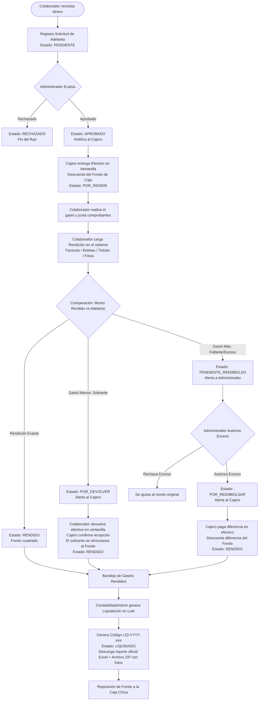

# 📘 Manual de Usuario y Flujo Operativo - Caja Chica
**CORPORACION CADILLO & ROJO SAC | Sistema PWA de Gestión, Rendición y Liquidación en Tiempo Real**  
*Versión del Sistema: 6.0.7*

---

## 📑 Tabla de Contenidos
1. [Introducción y Objetivos](#1-introducción-y-objetivos)
2. [Arquitectura y Canales de Acceso](#2-arquitectura-y-canales-de-acceso)
   - [Acceso mediante DNI](#acceso-mediante-dni)
   - [Instalación como PWA (Móvil y Escritorio)](#instalación-como-pwa-móvil-y-escritorio)
   - [Notificaciones Push y Sonoras en Tiempo Real](#notificaciones-push-y-sonoras-en-tiempo-real)
3. [Matriz de Roles y Permisos](#3-matriz-de-roles-y-permisos)
4. [Diagrama de Flujo Integral](#4-diagrama-de-flujo-integral)
5. [Ciclo de Vida Operativo Paso a Paso](#5-ciclo-de-vida-operativo-paso-a-paso)
   - [Paso 1: Solicitud de Dinero (Solicitante)](#paso-1-solicitud-de-dinero-solicitante)
   - [Paso 2: Aprobación Administrativa (Administrador)](#paso-2-aprobación-administrativa-administrador)
   - [Paso 3: Desembolso del Efectivo (Cajero / Usuario)](#paso-3-desembolso-del-efectivo-cajero--usuario)
   - [Paso 4: Rendición de Gastos y Comprobantes (Solicitante)](#paso-4-rendición-de-gastos-y-comprobantes-solicitante)
   - [Paso 5: Gestión de Sobrantes y Faltantes (Reembolsos)](#paso-5-gestión-de-sobrantes-y-faltantes-reembolsos)
   - [Paso 6: Liquidación Contable en Lote y Descarga ZIP](#paso-6-liquidación-contable-en-lote-y-descarga-zip)
   - [Paso 7: Arqueo y Reposición del Fondo](#paso-7-arqueo-y-reposición-del-fondo)
6. [Guía Detallada por Módulo](#6-guía-detallada-por-módulo)
   - [Módulo 1: Ingreso de Solicitud](#módulo-1-ingreso-de-solicitud)
   - [Módulo 2: Mis Solicitudes y Modal de Rendición](#módulo-2-mis-solicitudes-y-modal-de-rendición)
   - [Módulo 3: Bandeja de Aprobaciones](#módulo-3-bandeja-de-aprobaciones)
   - [Módulo 4: Arqueo & Balance](#módulo-4-arqueo--balance)
   - [Módulo 5: Reportes Excel & Estructura del Libro Caja Chica](#módulo-5-reportes-excel--liquidación-en-lote)
   - [Módulo 6: Maestro de DNIs (Sysadmin)](#módulo-6-maestro-de-dnis-sysadmin)
   - [Módulo 7: Maestro de Categorías y Centros de Costo](#módulo-7-maestro-de-categorías-y-centros-de-costo)
7. [Glosario de Estados del Sistema](#7-glosario-de-estados-del-sistema)
8. [Preguntas Frecuentes y Soporte](#8-preguntas-frecuentes-y-soporte)

---

## 1. Introducción y Objetivos

El sistema de **Caja Chica de CORPORACION CADILLO & ROJO SAC** es una plataforma web progresiva (PWA) diseñada para optimizar, transparentar y acelerar el ciclo de vida de los fondos fijos empresariales. 

### Objetivos Clave:
* **Eliminar el papel físico preliminar**: Digitalizar desde la solicitud de efectivo hasta el comprobante fiscal sustentatorio.
* **Control estricto de saldos**: Monitorear en tiempo real el dinero entregado, el saldo disponible en caja y las diferencias por reembolsar o reintegrar.
* **Trazabilidad total**: Registro auditado de quién solicitó, quién aprobó, quién desembolsó y quién liquidó cada movimiento.
* **Validación tributaria integrada**: Consulta en línea a SUNAT para validar la autenticidad y condición del emisor de facturas o boletas.

---

## 2. Arquitectura y Canales de Acceso

### Acceso mediante DNI
El ingreso al sistema no requiere contraseñas complejas que puedan olvidarse. El usuario simplemente digita su número de **DNI (8 dígitos)**.
1. El sistema valida contra el Maestro Central de Usuarios si el DNI está registrado y con estado **Activo**.
2. Al validar el DNI, se le asigna la sesión correspondiente con sus nombres, apellidos y permisos/roles específicos.
3. Se activa la suscripción de **notificaciones push directas** asociadas a dicho DNI.

### Instalación como PWA (Móvil y Escritorio)
El sistema funciona en navegadores web pero está optimizado para instalarse como una aplicación nativa:
* **En Android (Chrome)**: Tocar el botón **"Instalar"** en la barra superior o ir a los tres puntos del navegador > *Agregar a la pantalla principal*.
* **En iOS (Safari en iPhone/iPad)**: Pulsar el botón **Compartir** (icono de cuadrado con flecha hacia arriba) y seleccionar *“Agregar a pantalla de inicio”*.
* **En PC (Chrome / Edge)**: Hacer clic en el botón azul **"Instalar"** en la cabecera del sistema.

> [!NOTE]
> Las actualizaciones del aplicativo se descargan de manera silenciosa y automática en segundo plano (skipWaiting + Network First), asegurando que siempre se trabaje con la última versión disponible sin interrupciones.

### Notificaciones Push y Sonoras en Tiempo Real
El sistema cuenta con comunicación omnicanal:
1. **Push Notifications (OneSignal)**: Llegan incluso con la pantalla del celular bloqueada o la aplicación cerrada.
2. **Enrutamiento Inteligente**: Al pulsar una notificación recibida, el aplicativo se abre y redirige automáticamente a la pestaña correspondiente según el rol del usuario (por ejemplo, a la bandeja de aprobaciones para el administrador o a mis solicitudes para el colaborador).
3. **Alertas Sonoras (Web Audio API)**: Emite tonos distintivos cuando entra una nueva solicitud, se autoriza un pago o se rechaza un requerimiento.
4. **Toasts flotantes**: Mensajes visuales en la esquina inferior derecha con información resumida.

---

## 3. Matriz de Roles y Permisos

Un colaborador puede poseer uno o varios roles simultáneamente (por ejemplo, ser `ADMINISTRADOR` y a la vez `SOLICITANTE`):

| Función / Pestaña | SOLICITANTE | USUARIO (Cajero) | ADMINISTRADOR | SYSADMIN |
| :--- | :---: | :---: | :---: | :---: |
| **Ingreso Solicitud** (Pedir dinero) | ✅ | ❌ | ⚙️*(Si tiene rol) | ⚙️*(Si tiene rol) |
| **Mis Solicitudes** (Rendir cuentas) | ✅ | ❌ | ⚙️*(Si tiene rol) | ⚙️*(Si tiene rol) |
| **Módulo de Aprobación** (Visto bueno / Rechazo) | ❌ | ❌ | ✅ | ⚙️*(Si tiene rol) |
| **Arqueo & Balance** (Desembolsos y saldos) | ❌ | ✅ | ✅ | ✅ |
| **Reportes Excel & Liquidación en Lote** | ❌ | ✅ | ✅ | ✅ |
| **Maestro de DNIs** (Gestión de usuarios) | ❌ | ❌ | ❌ | ✅ |
| **Maestro de Categorías & Centros de Costo** | ❌ | ❌ | ❌ | ✅ |

---

## 4. Diagrama de Flujo Integral

El siguiente diagrama ilustra el flujo de negocio desde que un trabajador necesita dinero hasta el cierre contable:



---

## 5. Ciclo de Vida Operativo Paso a Paso

### Paso 1: Solicitud de Dinero (Solicitante)
1. El colaborador inicia sesión con su DNI.
2. Ingresa a la pestaña **"Ingreso Solicitud"**.
3. **Centro de Costo Obligatorio**: Viene en blanco por defecto para obligar al colaborador a seleccionar su área (`TRANS`, `ALM 1`, `ALM 2`, `ALM 3`, `ALM 4`, `LAB`, `REFRI`).
4. **Categoría del Gasto Obligatoria**: Viene en blanco por defecto para seleccionar conscientemente (`ADMINISTRACIÓN`, `VENTAS`, `PRODUCCIÓN`).
5. Indica el **Monto requerido en Soles (S/)** y la **Justificación o motivo** detallado del gasto.
6. Presiona **"Enviar Solicitud"**.
   - *Resultado*: Se genera un código correlativo único (ej. `SOL-2026-015`) en estado **PENDIENTE**.
   - Se despacha una alerta sonora y notificación push inmediata a todos los administradores.

### Paso 2: Aprobación Administrativa (Administrador)
1. El Administrador recibe la notificación y entra a la pestaña **"Módulo de Aprobación"**.
2. En la lista de pendientes, revisa el solicitante, el monto, el centro de costo y la justificación.
3. Puede:
   - **Aprobar**: Confirma la solicitud. El estado pasa a **APROBADO**. Se notifica al solicitante y al cajero.
   - **Rechazar**: Ingresa una observación obligatoria del motivo del rechazo. El estado pasa a **RECHAZADO** y finaliza la solicitud.

### Paso 3: Desembolso y Abono de Dinero con Sustento Obligatorio (Cajero / Usuario)
1. Con la solicitud en estado **APROBADO**, el colaborador se acerca a ventanilla o solicita la transferencia.
2. El Cajero entra a la pestaña **"Arqueo & Balance"** en la sub-bandeja **"Por Abonar"**.
3. El Cajero presiona el botón **"Entregar Dinero"** (o **"Entregar Reembolso"**).
4. Se abre el **Modal de Entrega de Dinero**:
   - Selecciona la **Modalidad de Abono**: *Efectivo en Caja*, *Transferencia Yape*, *Transferencia Plin*, *Transferencia BCP/BBVA/Interbank*, etc.
   - Digita el **N° de Operación o Recibo** (opcional).
   - **Adjunta obligatoriamente el Sustento del Abono**: Foto del recibo firmado o captura de la transferencia/Yape.
5. Al confirmar:
   - Descuenta automáticamente el monto entregado del **Monto Disponible** de la Caja Chica.
   - Cambia el estado de la solicitud a **POR_RENDIR** (o **RENDIDO** si era reembolso).
   - Registra el nombre del cajero, DNI, fecha exacta y almacena el comprobante de entrega.
   - Envía notificación push al colaborador indicando que su dinero fue entregado.

### Paso 4: Rendición de Gastos y Comprobantes (Solicitante)
1. Tras ejecutar los pagos o compras, el colaborador entra a **"Mis Solicitudes"**.
2. Ubica la solicitud en estado `POR RENDIR` y hace clic en el botón verde **"Rendir Cuentas"**.
3. En el formulario emergente, va agregando cada comprobante que sustenta el gasto:
   - **Tipo**: Factura Electrónica, Boleta de Venta, Recibo por Honorarios, Ticket, **Planilla de Movilidad** o Sin Comprobante Físico.
   - **Número de Comprobante**: Serie y correlativo (ej. `F001-0004523`, opcional para planillas).
   - **Fecha de Emisión**.
   - **RUC del Emisor (Estricto de 11 dígitos)**: Obligatorio para Facturas y Recibos por Honorarios. Si se escribe incompleto, el sistema alerta visualmente con un contador de dígitos faltantes. Consulta automática a SUNAT vía Factiliza al completar los 11 dígitos.
   - **Importe (S/)**: Monto exacto del comprobante.
   - **Sustento Obligatorio (Multiformato)**: Es 100% obligatorio adjuntar el archivo digital para agregar cualquier comprobante. Admite fotos desde el celular (`.jpg`, `.png`), documentos en PDF (`.pdf`), planillas en **Excel (.xlsx, .xls)** y formatos en **Word (.docx, .doc)**.
4. Puede agregar tantos comprobantes como sean necesarios (Factura de repuesto + Boleta de combustible + Planilla de movilidad, etc.).
5. El sistema calcula en vivo:
   - `Total Adelantado` vs `Total Rendido en Comprobantes`.
   - `Diferencia resultante`.
6. Hace clic en **"Finalizar y Enviar Rendición"**.

### Paso 5: Gestión de Sobrantes y Faltantes (Reembolsos)

#### Caso A: Gastó menos del adelanto (Hubo dinero sobrante)
* *Ejemplo*: Se entregó S/ 100.00 y rindió comprobantes por S/ 85.00.
* La solicitud pasa a estado **POR_DEVOLVER** y el **Cajero** recibe una alerta (push + aviso en vivo).
* El colaborador entrega los S/ 15.00 en efectivo en ventanilla.
* El Cajero, en **Arqueo & Balance > Devoluciones**, pulsa **"Confirmar Recepción"**.
* Recién en ese momento el sistema **reintegra** los S/ 15.00 al fondo disponible, registra quién recibió y cuándo, consolida el gasto en S/ 85.00 y la solicitud pasa a **RENDIDO**.

#### Caso B: Gastó exactamente lo entregado
* *Ejemplo*: Se entregó S/ 100.00 y rindió S/ 100.00.
* El estado pasa directamente a **RENDIDO**.

#### Caso C: Gastó más del adelanto (Faltante / Exceso asumido por el colaborador)
* *Ejemplo*: Se entregó S/ 100.00 y rindió comprobantes por S/ 130.00 (Diferencia a favor: S/ 30.00).
* La solicitud pasa a estado **PENDIENTE_REEMBOLSO**.
* El **Administrador** recibe una notificación de alta prioridad y en su bandeja de aprobaciones revisa los comprobantes adicionales.
* Si el Administrador da el visto bueno, cambia la solicitud a **POR_REEMBOLSAR**.
* El colaborador va a ventanilla y el **Cajero** pulsa **"Pagar Reembolso"**, entregándole los S/ 30.00 en efectivo.
* El sistema descuenta los S/ 30.00 de la caja, consolida el monto total en S/ 130.00 y la solicitud pasa a estado **RENDIDO**.

### Paso 6: Liquidación Contable en Lote y Descarga ZIP
1. El Administrador o encargado contable entra a la pestaña **"Reportes Excel"**.
2. Hace clic en el botón superior **"Liquidar Rendiciones"**.
3. Se abre el asistente de liquidación mostrando todas las solicitudes en estado `RENDIDO`:
   - El sistema calcula el siguiente código de liquidación oficial (ej. `LIQ-2026-004`).
   - Permite seleccionar o deseleccionar qué solicitudes formarán parte de este lote.
   - Muestra el resumen total en soles y la cantidad de comprobantes físicos digitalizados.
4. Al hacer clic en **"Procesar Liquidación & Descargar Archivos"**:
   - Todas las solicitudes seleccionadas cambian de estado a **LIQUIDADO**.
   - Quedan bloqueadas para evitar duplicidad de cobro o rendición.
   - Se descarga automáticamente:
     1. Un **reporte oficial en Excel (.xlsx)** con formato formal corporativo, carátula, resumen por centro de costo y tabla detallada de facturas.
     2. Un archivo **ZIP (.zip)** organizado por carpetas con todas las fotos y comprobantes sustentatorios en alta resolución.

### Paso 7: Arqueo y Reposición del Fondo
1. En la pestaña **"Arqueo & Balance"**, el custodio de caja revisa el nivel de efectivo disponible y el porcentaje consumido del presupuesto.
2. Cuando el saldo disponible es bajo tras liquidar las cuentas, Tesorería gira el cheque o transferencia de reposición.
3. El usuario autorizado hace clic en **"Reponer Fondo"**, ingresa el importe reincorporado (ej. S/ 450.00) y el saldo disponible vuelve a recargarse al 100%.

---

## 6. Guía Detallada por Módulo

### Módulo 1: Ingreso de Solicitud
* **Destinado a**: Colaboradores con rol `SOLICITANTE`.
* **Campos requeridos**:
  - **Centro de Costo**: Ubicación operativa del gasto (`TRANS`, `ALM 1`, `ALM 2`, `ALM 3`, `ALM 4`, `LAB`, `REFRI`).
  - **Categoría**: Clasificación presupuestal (`ADMINISTRACIÓN`, `VENTAS`, `PRODUCCIÓN`).
  - **Monto Solicitado**: En moneda nacional (PEN).
  - **Motivo / Concepto**: Explicación clara y concisa de la necesidad operativa.

### Módulo 2: Mis Solicitudes y Modal de Rendición
* **Destinado a**: Colaboradores para hacer seguimiento a sus propios vales.
* **Características**:
  - Filtro por estados: *Todos*, *Pendientes*, *Aprobados*, *Por Rendir*, *Rendidos*, *Reembolsos*.
  - Indicador visual del estado y fecha.
  - Botón **"Rendir Cuentas"** disponible únicamente cuando el estado es `POR_RENDIR`.
  - En el modal de rendición:
    - Búsqueda de RUC en SUNAT con auto-completado de Razón Social y condición (Habido / Activo).
    - Compresión de fotos en el navegador (reduce archivos de 10MB a menos de 500KB sin pérdida perceptible para no saturar memoria).
    - Contador interactivo de diferencia a favor o a devolver.

### Módulo 3: Bandeja de Aprobaciones
* **Destinado a**: Exclusivo para usuarios con rol `ADMINISTRADOR`.
* **Capacidades**:
  - Visualización de solicitudes pendientes de aprobación inicial (`PENDIENTE`).
  - Visualización de rendiciones con exceso que requieren autorización de reembolso (`PENDIENTE_REEMBOLSO`).
  - Ventana modal de detalle del requerimiento con visualizador de comprobantes.
  - Campo de observaciones para dejar constancia escrita de acuerdos o motivos de rechazo.

### Módulo 4: Arqueo & Balance
* **Destinado a**: `USUARIO` (Cajeros), `ADMINISTRADOR` y `SYSADMIN`.
* **Métricas en tiempo real**:
  - **Fondo Asignado Total**: Presupuesto techo de la caja (ej. S/ 500.00).
  - **Saldo Disponible en Caja**: Efectivo líquido actual para desembolsar.
  - **Total Egresado / Rendido**: Dinero ya gastado y justificado.
  - **Pendiente de Rendición**: Dinero en poder de los colaboradores en la calle.
* **Operaciones de Ventanilla**:
  - Desembolso de vales aprobados (`Abonar Efectivo`).
  - Desembolso de reembolsos autorizados (`Pagar Reembolso`).
  - Edición del fondo techo y registro de reposiciones de dinero.

### Módulo 5: Reportes Excel & Liquidación en Lote
* **Destinado a**: Control contable, tesorería y administración.
* **Estructura Oficial de la Hoja "Libro Caja Chica" en Excel (.xlsx)**:
  El reporte en Excel generado sigue de forma exacta el formato corporativo de liquidación de gastos:
  
  ```
  +----------------------------------------------------------------------------------------------------------------------------------+
  |                               LIQUIDACIÓN DEL FONDO DE CAJA CHICA DE CORPORACION CADILLO & ROJO SAC                              |
  +-------------------------------------------------------------+--------------------------------------------------------------------+
  | Area : Administrativo                                       | LIQUIDACION CAJA N.°: 001-2026                                     |
  +-------------------------------------------------------------+--------------------------------------------------------------------+
  | Nombre y Apellidos: ANDREA DEL CARMEN PARCO VELARDE         | Cargo: ASISTENTE DE TRANSPORTE                                     |
  +----+------------+---------+--------------------+----------------------------------+------------------------------+---------------+------------+
  | N° | Fecha      | Tipo    | Nro. De Comprobante| Razón Social                     | Descripción                  | Centro Costos | Importe S/ |
  +----+------------+---------+--------------------+----------------------------------+------------------------------+---------------+------------+
  | 1  | 26/09/2026 | FACTURA | FFF1-019264        | CRAGG CAMPOS GENOVEVA ELIZABETH  | PAGO DE CARTA NOTARIAL       | ADMINISTRACIÓN|      75.00 |
  | 2  | 02/09/2026 | FACTURA | F003-0002777       | CORPORACION FERRETERA ROSITA SAC | COMPRA DE PANEL LED          | ALMACÉN 1     |      60.00 |
  | 3  | 02/10/2026 | RECIBO  | 01242              | IMANOL MONTOYA                   | PAGO DIA DE APOYO 29/09 Y 28 | ALMACÉN 1     |     130.00 |
  | .. | ...        | ...     | ...                | ...                              | ...                          | ...           |        ... |
  +----+------------+---------+--------------------+----------------------------------+------------------------------+---------------+------------+
  |    |            |         |                    |                                  |                        TOTAL |               |    1250.00 |
  +----+------------+---------+--------------------+----------------------------------+------------------------------+---------------+------------+
  ```

* **Características del reporte:**
  1. **Desglose unitario de comprobantes**: Cada comprobante (factura, boleta, recibo, ticket, nota de venta) se exporta en una fila independiente.
  2. **Encabezado con celdas combinadas**: Título corporativo unificado, metadatos de Área, Código de Liquidación correlativo, Responsable y Cargo.
  3. **Hojas adicionales de control**:
     - **Arqueo & Balance**: Métricas del fondo fijo, disponible y fecha de emisión.
     - **Por Categoría**: Totales consolidados por tipo de gasto.
     - **Por Solicitante**: Resumen consolidado por cada colaborador.
  4. **Pestaña Historial de Liquidaciones Pasadas**: Permite consultar y descargar nuevamente el paquete **ZIP con el Excel estructurado y la carpeta de fotos/sustentos** de cualquier lote cerrado.

### Módulo 6: Maestro de DNIs (Sysadmin)
* **Destinado a**: Exclusivo para `SYSADMIN`.
* **Funciones**:
  - Registro de nuevos colaboradores con DNI, Nombres, Apellidos y Correo.
  - Asignación múltiple de roles con casillas de verificación (`SOLICITANTE`, `ADMINISTRADOR`, `USUARIO`, `SYSADMIN`).
  - Activación o desactivación de cuentas con un solo clic (bloqueo inmediato de acceso sin eliminar el historial de auditoría).

### Módulo 7: Maestro de Categorías y Centros de Costo
* **Destinado a**: Exclusivo para `SYSADMIN`.
* **Funciones**:
  - Creación y edición de categorías de gasto asociadas a Centros de Costo.
  - Habilitar o suspender temporalmente conceptos de gasto.

---

## 7. Glosario de Estados del Sistema

| Estado | Significado | ¿Afecta Fondo de Caja? | Acción Siguiente |
| :--- | :--- | :---: | :--- |
| **`PENDIENTE`** | La solicitud fue creada por el trabajador y espera revisión. | No | Administrador debe Aprobar o Rechazar. |
| **`RECHAZADO`** | El Administrador denegó la solicitud con un motivo justificado. | No | Fin del ciclo. No se entrega dinero. |
| **`APROBADO`** | El gasto fue validado y tiene luz verde para cobro. | No | El trabajador va a ventanilla de Caja a retirar el efectivo. |
| **`POR_RENDIR`** | El Cajero entregó el dinero en efectivo al trabajador. | **Sí (Disminuye disponible)** | El trabajador realiza las compras y rinde comprobantes. |
| **`PENDIENTE_REEMBOLSO`** | El trabajador rindió cuentas pero gastó más del adelanto recibido. | No | Administrador debe evaluar y autorizar el exceso. |
| **`POR_REEMBOLSAR`** | El Administrador aprobó el exceso a favor del trabajador. | No | Cajero debe abonar la diferencia en ventanilla. |
| **`POR_DEVOLVER`** | El trabajador rindió menos de lo recibido y debe devolver el sobrante. | No (hasta confirmar) | Cajero confirma la recepción del efectivo; el sobrante vuelve al fondo. |
| **`RENDIDO`** | Comprobantes cuadrados y conformes (reembolso pagado o devolución recibida). | Si hubo devolución confirmada, **aumenta disponible** | Listo para ser agrupado en la liquidación contable. |
| **`LIQUIDADO`** | El gasto fue cerrado formalmente en un lote oficial `LIQ-YYYY-###`. | No | Empaquetado final en Excel y ZIP para contabilidad. |

---

## 8. Preguntas Frecuentes y Soporte

### ❓ ¿Qué ocurre si un colaborador pierde un comprobante físico o incurrió en gastos de movilidad local?
En el modal de rendición puede seleccionar el tipo **"Planilla de Movilidad"** o **"Sin Comprobante Físico"**, explicando detalladamente el motivo o ruta y adjuntando obligatoriamente su formato de sustento (en Excel, Word, PDF o foto firmada).

### ❓ ¿Por qué no recibo las notificaciones push en mi teléfono móvil?
1. Asegúrate de haber presionado el botón **"Permitir"** cuando el navegador solicitó permisos de notificación.
2. En Android, verifica en *Ajustes > Aplicaciones > Chrome (o la app instalada) > Notificaciones* que no estén silenciadas.
3. En iOS (iPhone), las notificaciones push de aplicaciones web requieren que la aplicación esté agregada a la pantalla de inicio mediante Safari (iOS 16.4 o superior).

### ❓ ¿Cómo se consulta la información de un RUC si no carga automáticamente?
El sistema incluye consulta directa al servicio Factiliza conectado a SUNAT. Si el servicio experimenta lentitud por parte del servidor tributario, el usuario puede digitar manualmente la Razón Social en el campo correspondiente sin bloquear el proceso de rendición.

### ❓ ¿Se puede anular una liquidación ya procesada?
Los registros en estado `LIQUIDADO` quedan protegidos por integridad contable. Si se requiere una corrección excepcional, debe ser gestionada por el usuario con rol `SYSADMIN`.

---
*Manual elaborado para CORPORACION CADILLO & ROJO SAC - Sistema Caja Chica v6.0.7*
